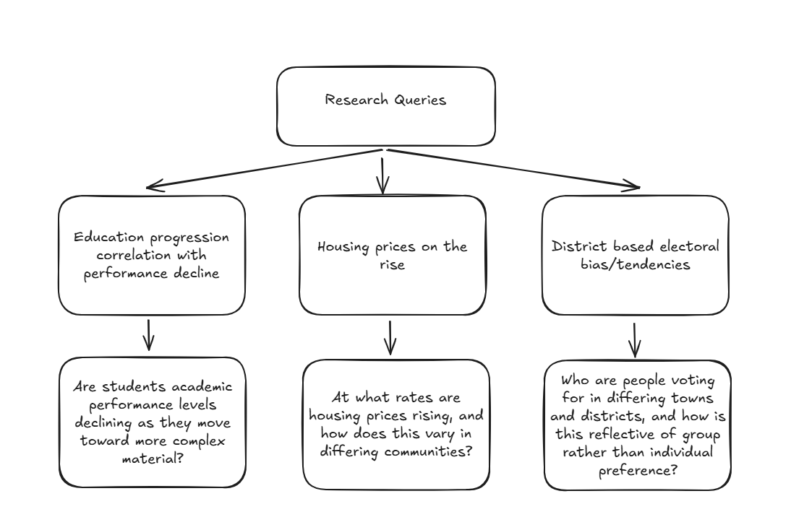

# 9CT-Task3
## Mind map

## Thesis
From primary school to the end of high school, are students getting more or less proficient in literacy and mathematics, in Middle East, Central America, South America, Europe, Scandanavia, Oceania and Canada, comparatively?
## Raw CSV file from Kaggle
https://www.kaggle.com/datasets/nelgiriyewithana/world-educational-data 
## Functional and Non-Functional Requirements
### Functional
- Filters global_education.csv for grade_2_3_proficiency_reading, grade_2_3_proficiency_math, lower_secondary_end_proficiency_reading, lower_secondary_end_proficiency_math, youths_15_24_literacy_rates_male, and youths_15_24_literacy_rates_female columns
- Filters for the countries Argentina, Australia, Brazil, Canada, Chile, Colombia, Dominican Republic, Ecuador, Finland, France, Georgia, Germany, Guatemala, Qatar, Republic of Ireland, Mexico, Netherlands, New Zealand, Norway, Panama, Paraguay, Peru, Poland, Portugal, Saudi Arabia, Slovakia, Sweden, U.A.E
- Computes regional averages
- Visualise data in a bar graph, with primary school and high school data per country side-by-side, each distintly coloured.
### Non-Functional
- Usability: GUI must allow simple interaction with data, "README" document oultines all aspects of the project, including thesis, requirements, code tests, and evaluation.
- Reliability: Data is cross-referenced and compared to various sources.
## Research
### SEE-I Paragraphs
International assessment data indicates that a prominent portion of Latin American and Carribean students are failing to meet basic profiency in mathematics and literacy, and that this is continuing to be exacerbated as they progress from primary school into high school. Specifically, over the past ten years UNESCO data indicates that while roughly one half of third-graders are meeting minimum proficiency requirements, this is falling to as little as a third, in mathematics, by high school. On the whole, this is generally indicative of a concerning failure, within poorer countries, of continual academic study to translate into improved academic performance.

Students within western Europe, however, are shown with similiar assessment data to meet the minimum benchmark at an appreciably high level, with only a gradual decline into high school. Upon examination of the TMIS 2019 International Mathematics measurement data it is to be seen that 96%, 97%, 85% and 95% of students in the countries of England, Ireland, France and Portugal, respectively have met or exceeded the low benchmark. Continuing on into high school, it is to be noted that these measurements shift to 90%, 94%, 88% and 91%, respectively. Expectedly, and contrasting to students within Latin America and the Carribeans, this data is representative of the healthy continuation of academic performance in the developed nations.
### Sources
- https://www.unesco.org/en/articles/unesco-warns-lack-progress-basic-learning-achievements-2013-latin-america-and-caribbean
- https://www.unesco.org/en/articles/effects-pandemic-education-latin-america-and-caribbean-will-last-many-years-there-urgent-need
- https://www.iea.nl/sites/default/files/2020-12/TIMSS-2019-International-Results-in-Mathematics-and-Science.pdf
- https://www.iea.nl/sites/default/files/2020-12/TIMSS-2019-International-Results-in-Mathematics-and-Science.pdf
## Data Dictionary
The following data dictionary is in reference to the [Global_Ed_Cleaned2 csv](https://github.com/oscarcoleman/9CT-Task3/blob/main/Global_Ed_Cleaned2.csv):

|Field                                   | Datatype   | Format for display | Description                                                                                    | Example   | Validation |
|----------------------------------------|------------|--------------------|------------------------------------------------------------------------------------------------|-----------|------------|
|Countries and areas	                   |String      |XX...XX             |Name of country being measured                                                                  |Australia  |Can be any amount of letters, must not contain numbers|
|Grade_2_3_Proficiency_Reading           |Integer     |NNN                 |Percentage score of Grade 2-3 students meeting basic proficiency in literacy                    |50         |1 to three integers, from 0-100 |
|Grade_2_3_Proficiency_Math              |Integer     |NNN                 |Percentage score of Grade 2-3 students meeting basic proficiency in math                        |50         |1 to three integers, from 0-100 |
|Primary_End_Proficiency_Reading         |Integer     |NNN                 |Percentage score of students at the end of primary school meeting basic proficiency in literacy |50         |1 to three integers, from 0-100 |
|Primary_End_Proficiency_Math            |Integer     |NNN                 |Percentage score of students at the end of primary school meeting basic proficiency in math     |50         |1 to three integers, from 0-100 |
|Lower_Secondary_End_Proficiency_Reading |Integer     |NNN                 |Percentage score of students at the end of high school meeting basic proficiency in literacy    |50         |1 to three integers, from 0-100 |
|Lower_Secondary_End_Proficiency_Math    |Integer     |NNN                 |Percentage score of students at the end of high school meeting basic proficiency in math        |50         |1 to three integers, from 0-100 |

## Code
### Week 2 and Week 3
I developed the code for filtering rows and columns for desired countries:
#### Filter_columns.py
The following code removes the unnecessary columns from the raw file and moves them to a cleaned file "Global_Education_Cleaned.csv"
```
columns = [ 
           'Latitude ',
           'Longitude', 
           'OOSR_Pre0Primary_Age_Male', 
           'OOSR_Pre0Primary_Age_Female', 
           'OOSR_Primary_Age_Male', 
           'OOSR_Primary_Age_Female',
           'OOSR_Lower_Secondary_Age_Male',
           'OOSR_Lower_Secondary_Age_Female',
           'OOSR_Upper_Secondary_Age_Male',
           'OOSR_Upper_Secondary_Age_Female',
           'Completion_Rate_Primary_Male',
           'Completion_Rate_Primary_Female',
           'Completion_Rate_Lower_Secondary_Male',
           'Completion_Rate_Lower_Secondary_Female',
           'Completion_Rate_Upper_Secondary_Male',
           'Completion_Rate_Upper_Secondary_Female',
           'Birth_Rate',
           'Gross_Primary_Education_Enrollment',
           'Gross_Tertiary_Education_Enrollment',
           'Unemployment_Rate',
           'Youth_15_24_Literacy_Rate_Male',
           'Youth_15_24_Literacy_Rate_Female'
]

df = df.drop(columns=columns)

df.to_csv('Global_Education_Cleaned.csv', index=False)
```
#### Filter_rows.py
The following code selects the rows for the desired countries and move them to a new file "Global_Ed_Cleaned2.csv", which will be used for final analysis.
```
df = pd.read_csv("Global_Education_Cleaned.csv", encoding='ISO-8859-1')

rows = [7, 9, 24, 33, 36, 37, 38, 50, 53, 54, 63, 64, 67, 68, 72, 85, 114, 126, 127, 133, 137, 139, 142, 143, 162, 173, 198]

df = df.iloc[rows, :]

df.to_csv("Global_Ed_Cleaned2.csv", index=False)
```
### Week 3 Continued and Week 4
#### Visualisations.py
##### Individual Country Display
The following code is for the display of data concerning Europe. I, as can be seen in visualisations.py, have done the same for each region with the specific details, particularly the rows, changed as per the region:
```
# ----- EUROPE LITERACY

rows_eu = [10, 12, 14, 16, 22, 23, 26] 

values1_eu = df.iloc[rows_eu, 1] 
values2_eu = df.iloc[rows_eu, 3]
values3_eu = df.iloc[rows_eu, 5]

labels = df.iloc[rows_eu, 0].tolist()
labels_shifted = labels[:1] + labels[1:]


x = np.arange(len(labels_shifted)) 
width = 0.2

fig, ax = plt.subplots(figsize=(12, 6))

ax.bar(x - width, values1_eu, width, label='Mid-Primary School')
ax.bar(x, values2_eu, width, label='End-Primary School')
ax.bar(x + width, values3_eu, width, label='End-High School')

ax.set_xticks(x)
ax.set_xticklabels(labels_shifted, rotation=45, ha='right')
ax.set_ylabel('Score')
ax.set_title('Europe Student Literacy Performance')
ax.legend()
plt.savefig('eu_literacy.png')

# ----- EUROPE MATH

values4_eu = df.iloc[rows_eu, 2] 
values5_eu = df.iloc[rows_eu, 4]
values6_eu = df.iloc[rows_eu, 6]

x = np.arange(len(labels_shifted)) 
width = 0.2

fig, ax = plt.subplots(figsize=(12, 6))

ax.bar(x - width, values4_eu, width, label='Mid-Primary School')
ax.bar(x, values5_eu, width, label='End-Primary School')
ax.bar(x + width, values6_eu, width, label='End-High School')

ax.set_xticks(x)
ax.set_xticklabels(labels_shifted, rotation=45, ha='right')
ax.set_ylabel('Score')
ax.set_title('Europe Student Math Performance')
ax.legend()
plt.savefig('eu_math.png')
```
Explanation:
- rows_eu: list of indeces from Global_Ed_Cleaned2.csv that consists of each country being researched and their accompanying data
- values1_eu (as well as 2, 3, 4, 5, 6): finds specific data from column, e.g of primary school math or high school literacy.
- The first block of code below is as in the more complete above code, however it is specific to such. The second attached code below is regular for the rest of visualisations.py. The code was changed for the European data due to a problem in linking the values data and the labels data, namely that the label was ascribed to an index one greater than desirable.
```
labels = df.iloc[rows_eu, 0].tolist()
labels_shifted = labels[:1] + labels[1:]
```

```
labels = df.iloc[rows_ca, 0].tolist()
```
##### Avg regional scores
The following code is again specific to the European data, but is only slightly tweaked for the rest of the countries. Its aim is to find a set of average scores for each region which can later be used to represent that region in the world data:
```
# EUROPE
values1_eu_clean = values1_eu.replace(0, np.nan)
avg_total_values1_eu = values1_eu_clean.mean(skipna=True)

values2_eu_clean = values2_eu.replace(0, np.nan)
avg_total_values2_eu = values2_eu_clean.mean(skipna=True)

values3_eu_clean = values3_eu.replace(0, np.nan)
avg_total_values3_eu = values3_eu_clean.mean(skipna=True)

values4_eu_clean = values4_eu.replace(0, np.nan)
avg_total_values4_eu = values4_eu_clean.mean(skipna=True)

values5_eu_clean = values5_eu.replace(0, np.nan)
avg_total_values5_eu = values5_eu_clean.mean(skipna=True)

values6_eu_clean = values6_eu.replace(0, np.nan)
avg_total_values6_eu = values6_eu_clean.mean(skipna=True)
```
Explanation: 
- values1_eu.replace(0, np.nan) replaces any '0' values with numpy 'nan' values so that they can be cleaned out in the following line.
- values3_eu_clean.mean(skipna=True) cleans the list to ensure no empty values interfere with the calculation, and then computes a regional avg.
##### World Data Display
The following code is used to display the regional averages for world literacy results, the same is applied for mathematics albeit with different avg values.
```
# ----- WORLD LITERACY 

values1_w = [
    avg_total_values1_scan,  
    avg_total_values1_eu,    
    avg_total_values1_ca,    
    avg_total_values1_sa,    
    avg_total_values1_me,    
    avg_total_values1_oc,
    values1_can             
] 

values2_w = [
    np.nan,                  
    avg_total_values2_eu,    
    avg_total_values2_ca,    
    avg_total_values2_sa,    
    np.nan,                  
    np.nan,                  
    np.nan                  
] 

values3_w = [
    avg_total_values2_scan,  
    avg_total_values3_eu,    
    avg_total_values3_ca,    
    avg_total_values3_sa,    
    avg_total_values2_me,    
    avg_total_values2_oc,    
    values2_can              
] 

with open("regions.txt", "r") as txt_file:
    lines = txt_file.readlines()

labels = lines[:7]

x = np.arange(len(labels)) 
width = 0.2

fig, ax = plt.subplots(figsize=(12, 6))
ax.bar(x - width, values1_w, width, label='Mid-Primary School')
ax.bar(x, values2_w, width, label='End-Primary School')
ax.bar(x + width, values3_w, width, label='End-High School')

ax.set_xticks(x)
ax.set_xticklabels(labels)
ax.set_ylabel('Score (% of students meeting basic profiency)')
ax.set_title('World Student Literacy Performance')
ax.legend()
plt.savefig('world_literacy.png')
plt.show()
```
Explanation:
- values1_w and its accompanying lists store each regional average.
- The following code creates the graph labels using the text file (create_txt.py) containing each region name: Scandanavia, Europe, Central America, South America, Middle East Oceania, Canada
```
with open("regions.txt", "r") as txt_file:
    lines = txt_file.readlines()

labels = lines[:7]
```
- It then displays using matplotlib as per usual
### Week 4 continued
#### App.py
The app.py code is used to create an accessible and comprehensive GUI using streamlit (https://streamlit.io/) to display all of the data alongside my thesis and findings. I will not elaborate on explanations here.
## GUI
My Streamlit app containing the completion of my findings alongside my thesis and data is accessible via the following URL:
https://9ct-task3-w5qozqkaydwelghspbwktn.streamlit.app/ 
## Findings Analysis
The research carried out in this project has served to indicate a few general trends that warrant discussion across, seperately, literacy and mathematics. Throughout the world, in literacy, there is a common downard trend from mid-primary school to the end of high school, with a mean decline of 22.65% across all regions. Although the drop is more substantial in developing countries, the trend is markedly visible all across the globe and, given the roughly even distribution of rich and poor countries, the average decline seems adequetly descriptive of the general trend.

In mathematics, the most pronounced pattern is not one all-encompassing and general trend, but rather the substantial distinction between the developed and developing countries. While in the developed regions, such as Europe and Scandanavia, but also the given Middle Eastern countries, mathematical proficiency remains fairly steady throughout schooling (mostly around 80-90%, but closer to 30-40% for the Middle East), the undeveloped regions of Central and South America (including the Carribeans) undergo a severe drop, between mid-primary school and the end of high school, in excess of 50%, on average. 

Beyond the key general trends to be extracted, there remain some specific regional anomalies worthy of note. Particularly, while it is to be seen that most European countries have neglibible or minimally improved change in academic performance from early primary school to the end of high school, France's scores are shown to improve by a margin of roughly 30%. Nevertheless, outstanding instances such as these are seldom, and it is visible that each individual region holds within it a common and generally observable trend.
## Conclusion
While, as shown in the above analysis, the results are indeed multifaceted, it may generally be stated that students academic performance remains stagnant or declines as they progress from primary school to high school.
## Evaluation
On the whole, I would consider myself to have carried out a complete and comprehensive projects that has met the demands initially laid out, alongside answering the research thesis in thorough detail. First of all, concerning the functional requirements, my project successfully filters out of the raw csv file each desired countries and their proficiency scores, which is then taken to be visualised, precisely as desired, using matplotlib and with all regional averages accurately computed. Regarding the non-functional requirements, the GUI extensively covers all aspects of the research results that may be of interest, ensuring that it is highly accessible in a straightfoward and interconnected manner. Moreover, the README file in which I am writing this evaluation includes complete week-by-week documentation, alongside all other project components — data dictionaries, requiremnts, analysis, etcetera — either explicity shown or linked. To sum, I do indeed believe that my project has been fulfilled to the best of my ability, with the results to be seen comprehensively within this github repository. 
